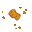

# Tutorial for Review 2021-02

This tutorial shall demonstrate the modeling of MPWs by extending the hamster-simulator to pick and put breadcrumbs.

Some notes on the extension:

* There shall be a new breadcrumb prop , which can be picked or put by the hamster.
* Different to grain, the hamster can put breadcrumbs on a tile, independent of previously collected ones.
* When the hamster is on a tile with a breadcrumb, it can pick the breadcrumb.

## Preparation

* Download "Eclipse Modeling Tools" from https://www.eclipse.org/downloads/packages/
* Use Java JDK 15
* Install required Eclipse features
    * use the `p2f` file from `https://raw.githubusercontent.com/SQAHamster/mpw-modeling-hamster/master/releng/installed-items.p2f`
        * Note: the file has to be on the local file-system, Eclipse will not accept the URL directly
    * File / Import / Install / Install Software Items from File
    * Note: Includes Maven, Henshin, Query-DSL, MPW Modeling Framework, CDT, Tycho Configurators, Xpand
* Optional: install Docker on the local machine (use to have an isolated build environment)

## Import Hamster Modeling Enviroment
    
* Clone mpw-modeling-hamster
    * from https://github.com/SQAHamster/mpw-modeling-hamster.git
        * `git clone https://github.com/SQAHamster/mpw-modeling-hamster.git`
* Import with Maven: "Existing Maven Projects"
    * Note: Dependent on the checkout and concrete import steps, the root project either is imported as "mpw-modeling-hamster" or "hamster-modeling-root"


* Set active target platform by clicking on the link on the top right corner as shown in the image below
    * Note: This takes some time, since dependencies are downloaded
    * inspect the loading progress bar on the bottom right corner of Eclipse to see when finished (progress bar has to disappear) 


* Right click on "mpw-modeling-hamster" / Run As / Maven generate-sources


Now, the projects shall be error free.
(If git indicates changes in `.project` files, ignore them)

# Model a Breadcrumb entity

* open the `Hamster.aird` file under "de.unistuttgart.iste.sqa.mpw.modeling.hamstersimulator/model"
* under "Design/Entities in a Class Diagram", open the "hamster class diagram"
* add a class named `Breadcrumb` and let it derive from `Prop`


# Model Put and Pick Breadcrumb commands

* stay in project "de.unistuttgart.iste.sqa.mpw.modeling.hamstersimulator" and to "src-commands"
* add a new Henshin file in the "game" package to create a new game command for the hamster
    * New / Other... / Henshin Diagram
    * name it `putBreadcrumb.henshin_diagram`
* in the `.henshin_diagram` file, right click in the white area and import the `hamster` package with "From Workspace"


* also import the `mpw` package, but here you have to choose "From Registry" (radio button "Runtime Version")


* name the module "putBreadcrumb" in the properties sheet


* create the rule
    * add rule `putBreadcrumb`
    * add nodes inside the rule
        * `Hamster` node with name `self`
        * `Territory` node
        * `Tile` node
        * `Breadcrumb` node, in its properties set Action to `create`
    * add references
        * from the Hamster node to the Tile node (reference "currentTile")
        * from the Tile node to the Breadcrumb node (reference "contents"), in its properties set Action to `create`
        * from the Breadcrumb node to the Territory node (reference "stage"), in its properties set Action to `create`
        * from the Hamster node to the Territory node (reference "stage")
            * Note: henshin gives a warning, since the backward link also has to be added
            * to do so: add also a reference from Territory to Hamster (reference "tileContents")
            


Repeat the steps for the "pickBreadcrumb" rule, instead of `create` use `delete` actions.
Do not forget to name the module to "pickBreadcrumb" also.

Note: If you change the action in the properties to "delete" and the diagram does not update, move the label or reopen the diagram to see the effect, this is a bug in Henshin.


When finished, perform a `mvn install` or `mvn package` on "mpw-modeling-hamster" and see if it no errors occur.

Optionally, use the following docker command to avoid possible complications with the environment:

`docker run -it --rm --name mpw-modeling-hamster -v "$(pwd)":/usr/src/mpw-modeling-hamster -v"$(pwd)/local-m2":/root/.m2 -w /usr/src/mpw-modeling-hamster maven:3.6.3-openjdk-15-slim mvn install`

You might inspect the transformed models in the "/debugout" folder.

# Model breadcrumbAvailable query

* goto "src-queries/queries/hamster"
* create a `breadcrumbAvailable.query` file (New / General / File)
* fill it with logic to check the current tile for a breadcrumb

```java
context Hamster
/** Checks the hamster's current tile for a breadcrumb. */
query breadcrumbAvailable: self.currentTile.contents->typeSelect(Breadcrumb)->notEmpty();
```

* Note: Currently no type-based auto-completion is supported in the Query-DSL. This could be improved in future, since the Ecore files are available on a known file-path.

# Model constraints for the pick / put breadcrumb commands

* goto "src-queries/conditions/gamehamster"
* create a `putBreadcrumbConstraints.query` file
* add a pre- and postcondition

```java
context Hamster::putBreadcrumb

/** on the current tile, only the hamster has to be contained */
precondition: self.currentTile.contents->size() = 1 and self.currentTile.contents->at(0) = self;

/** on the current tile, now also a breadcrumb has to be contained */
postcondition: self.currentTile.contents->size() = 2 and self.breadcrumbAvailable();
```

* also create a `pickBreadcrumbConstraints.query` file

```java
context Hamster::pickBreadcrumb

/** on the current tile, a breadcrumb has to be contained */
precondition: self.breadcrumbAvailable();

/** on the current tile, now only the hamster has to be contained */
postcondition: self.currentTile.contents->size() = 1 and self.currentTile.contents->at(0) = self;
```

# Extend presenter (Java)

## Regenerate

After finishing the modeling of the Breadcrumb entity, a query and the two commands with conditions, regenerate again with `Maven install` or `Maven package` on the "mpw-modeling-hamster" project.

## Extend the HamsterGameViewPresenter

* open the Maven-based Java simulator under `/simulators/de.unistuttgart.iste.sqa.mpw.hamstersimulator.java`
    * use an IDE of choice, like Eclipse or IntelliJ
* goto "/core/src/main/java/de/unistuttgart/hamster/viewmodel/impl" and open the "HamsterGameViewPresenter" class
* create a `configureBreadcrumbImageView()` method, which makes use of a simple `refreshBreadcrumbLayer()` helper method

```java
	// create a layer for the breadcrumb image
	private void configureBreadcrumbImageView(final ViewModelCell cell, final Tile tile) {
		final var layer = new ViewModelCellLayer();
		layer.setImageName("Breadcrumb");
		refreshBreadcrumbLayer(layer, tile);
		cell.getLayers().add(layer);
	}

	// set the breadcrumb visibility to true, if the tile contains a Breadcrumb object
	private void refreshBreadcrumbLayer(final ViewModelCellLayer layer, final Tile tile) {
		final boolean containsBreadcrumb = tile.getContents().stream().anyMatch(Breadcrumb.class::isInstance);
		layer.setVisible(containsBreadcrumb);
	}
```

* in the existing `onSetTileNodeAtForCell()` method, call the new configure method

```java
	@Override
	protected void onSetTileNodeAtForCell(final ViewModelCell cell, final Tile tile) {
		configureWallImageView(cell, tile);
		configureGrainImageView(cell, tile);
		configureBreadcrumbImageView(cell, tile);

		final Optional<ReadOnlyHamster> hamsterOptional = findHamsterOnTile(tile);
		hamsterOptional.ifPresent(readOnlyHamster -> configureHamsterImageView(cell, readOnlyHamster));
	}
```

* Note: `onSetTileNodeAtForCell` is called every time, if the tile contents have changed

* now, add the `Breadcrumb32.png`  (https://github.com/SQAHamster/mpw-modeling-hamster/raw/master/tutorial/Breadcrumb32.png) image to `/ui/src/main/resources/images`

* last, extend the `loadPropImages()` method in `ui/src/main/java/de/unistuttgart/hamster/ui/TileNode`, for mapping the symbolic image name

```java
    private static void loadPropImages() {
        images.put("Wall", new Image("images/Wall32.png"));
        for (int i = 1; i <= 12; i++) {
            images.put(i + "Corn", new Image("images/" + i + "Corn32.png"));
        }
        images.put("Breadcrumb", new Image("images/Breadcrumb32.png"));
    }
```

* finally, adapt an example or create a new one, and test the breadcrumb commands :-)
    * under `/examples/src/main/java/de/unistuttgart/hamster/examples`
    


# Extend presenter (C++)

Optionally, also the C++ simulator can be extended for the new breadcrumb entity.

## Extend the C++ HamsterGameViewPresenter

* open the CMake-based C++ simulator under `/simulators/de.unistuttgart.iste.sqa.mpw.hamstersimulator.cpp`
    * use an IDE of choice, like Visual Studio or CLion
* goto "/core/src/impl" and open the "HamsterGameViewPresenter.h" class header
    * include the "Breadcrumb.h" file
    * declare two methods `configureBreadcrumbImageView()` and `refreshBreadcrumbLayer()`

```cpp
private:
    ...
    void configureBreadcrumbImageView(ViewModelCell& cell, const mpw::Tile& tile);
    void refreshBreadcrumbLayer(ViewModelCellLayer& layer, const mpw::Tile& tile);
```

* declare a helper method to return the breadcrumbs on a given tile
    
```cpp
private:
...
    static std::list<std::shared_ptr<hamster::Breadcrumb>> getBreadcrumbsOfTile(const mpw::Tile& tile);
```

* next, goto the related "HamsterGameViewPresenter.cpp" class source

    * implement the `configureBreadcrumbImageView()` and `refreshBreadcrumbLayer()` methods

```cpp
void HamsterGameViewPresenter::configureBreadcrumbImageView(ViewModelCell& cell, const Tile& tile) {
    auto breadcrumbLayer = std::make_shared<ViewModelCellLayer>();
    breadcrumbLayer->setImageName("Breadcrumb32");
    refreshBreadcrumbLayer(*breadcrumbLayer, tile);

    cell.addToLayers(breadcrumbLayer);
}

void HamsterGameViewPresenter::refreshBreadcrumbLayer(ViewModelCellLayer& layer, const Tile& tile) {
    layer.setVisible(!getBreadcrumbsOfTile(tile).empty());
}
```


* implement the `getBreadcrumbsOfTile()`

```cpp
std::list<std::shared_ptr<hamster::Breadcrumb>> HamsterGameViewPresenter::getBreadcrumbsOfTile(const Tile& tile) {
    return type_select<hamster::Breadcrumb>(const_cast<Tile&>(tile).getContents());
}
```

* in the existing `onSetTileNodeAtForCell()` method, call the new configure method

```cpp
void HamsterGameViewPresenter::onSetTileNodeAtForCell(ViewModelCell& cell, const mpw::Tile& tile) {
    configureWallImageView(cell, tile);
    configureGrainImageView(cell, tile);
    configureBreadcrumbImageView(cell, tile);
    for (std::shared_ptr<ReadOnlyHamster> hamster : getHamstersOfTile(tile))
    {
        configureHamsterImageView(cell, *hamster);
    }
}
```

* now, add the `Breadcrumb32.png`  (https://github.com/SQAHamster/mpw-modeling-hamster/raw/master/tutorial/Breadcrumb32.png) image to `/ui/resources/images`

* last, extend the `onInitialized()` method in `ui/HamsterApplicationHandler.cpp`, for loading the image

```cpp
void HamsterApplicationHandler::onInitialized(SdlApplication& application) {
    this->application = &application;
...
    loadTexture("Wall32");
    loadTexture("Breadcrumb32");
...
}
```

* finally, adapt an example or create a new one, and test the C++ breadcrumb commands :-)
    * under `/examples`

# Sample Solution

If necessary, the sample solution for this tutorial can be found here: `https://github.com/SQAHamster/mpw-modeling-hamster/tree/tutorial-solution`

# Troubleshoooting

## Maven Build Errors for Modeling Environment

Please use Docker if any error occurs which not seems to be caused by the tutorial steps.

`docker run -it --rm --name mpw-modeling-hamster -v "$(pwd)":/usr/src/mpw-modeling-hamster -v"$(pwd)/local-m2":/root/.m2 -w /usr/src/mpw-modeling-hamster maven:3.6.3-openjdk-15-slim mvn install`

Note: Perform the command on the root of the check-out directory.
